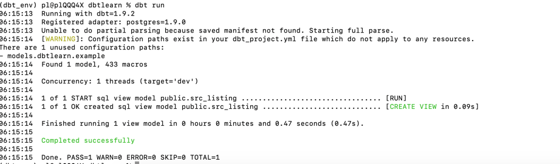
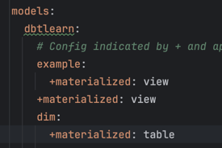
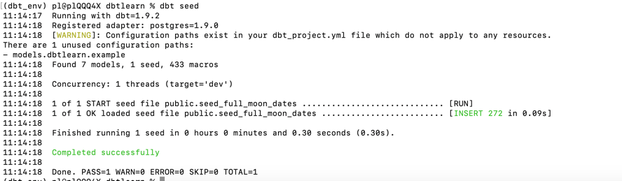
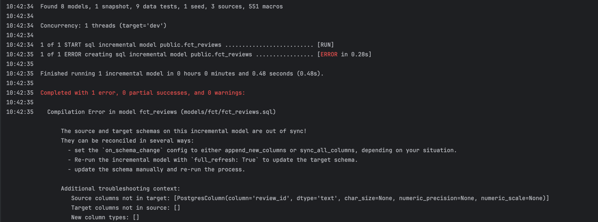
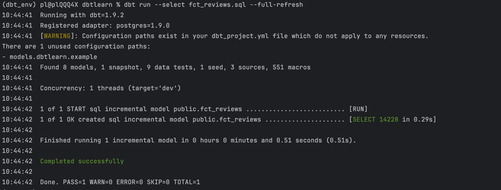

create sql in models 
dbt run to run the models , to create view 

Materialization 
1. Views
2. Table 
3. Incremental
4. Ephemeral  

Define Materialization Types in dbt_project.yml

src can be cte make it ephemeral as we dont need those objects

seed to upload local csv to db 
-- dbt seed

sources --> Alias for database tables

dbt compile : syntax check
source freshness added in yaml

freshness command : dbt source freshness

snapshots : SCD 
dbt snapshot

dbt tests , create schema.yml
dbt test

1. Generic Tests -> Inbuilt tests 
 - not null
 - unique
 - relationship
 - accepted_values
2. Singular Tests 
Create SQL's in test folder 

Macros 
1. generic Macros 
2. test macros -> to be called from schema.yaml

regenerate incr tables in case of schema change , 

dbt run --select <sql> --full-refresh 

Generate docs 
add description in schema.yml 
dbt docs generate
dbt docs serve

assets folder to create image locally/update in project.yml

hooks
1. on_run_start
2. on_run_end
3. pre-hook
4. post-hook

Install Packages 
 dbt deps 

add test in schema yml and source yml
for source tables add GE tests in source

To run test for certain source 
 dbt test --select source:airbnb.listings , runs test for dependent tables as well 

macros for logging
dbt run-operation <macro-name>

variables defined in macros , 2 types of macros 
1. Jinga variables : Define with set keyword , concant with ~ 
dbt run-operation learn_variables --vars '{user_name: zoltanctoth}'
2. dbt variables / project variables 
define default values in project.yml , vars
dbt run --select fct_reviews.sql --vars '{start_date:"2024-01-15 00:00:00",end_date:"2024-03-15 23:59:59"}'
use var key word to print/log ~var("var_name")
